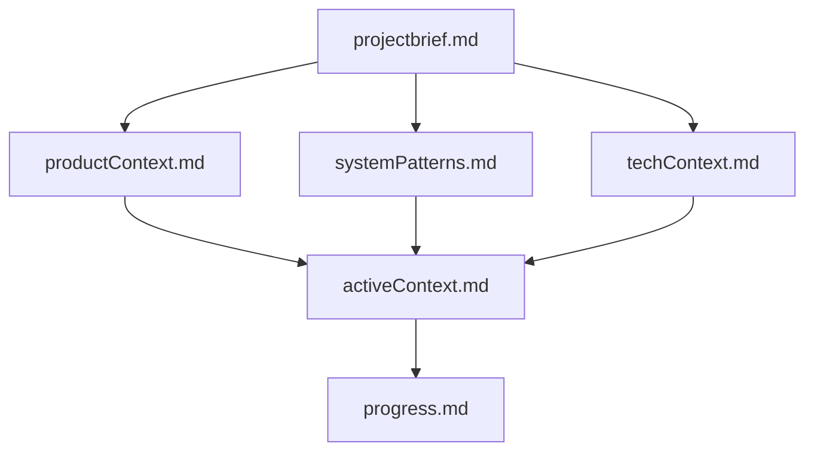
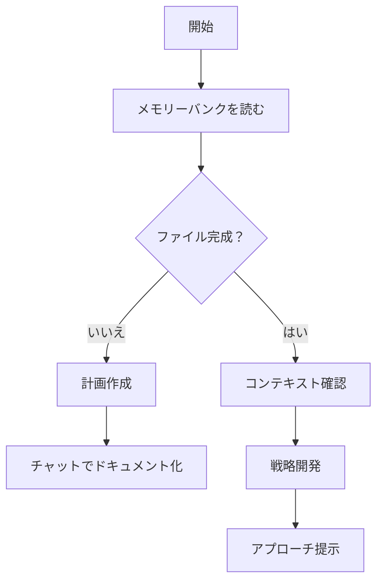
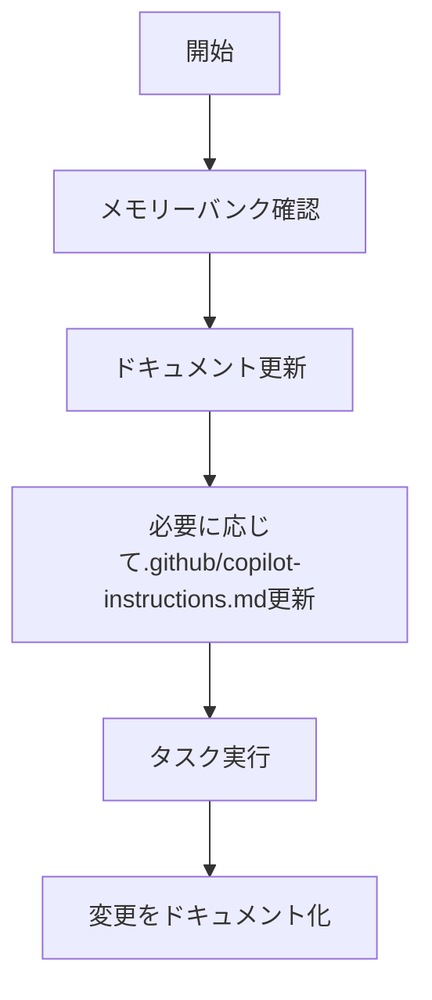
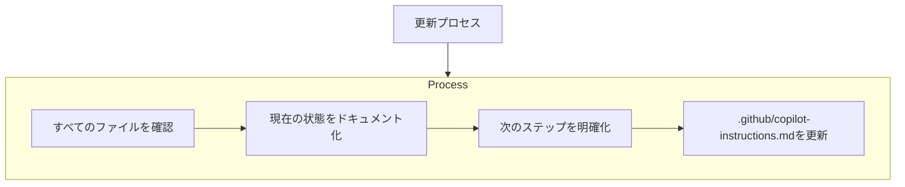
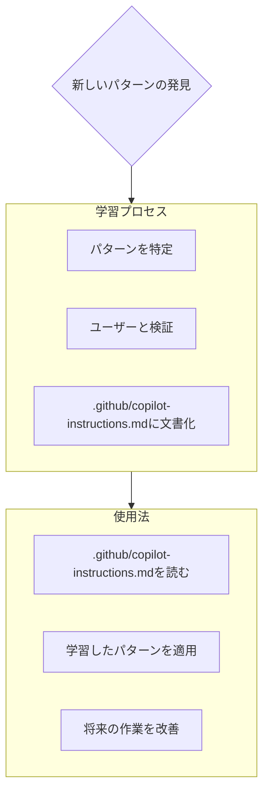

# GitHub Copilot インストラクション

## プロジェクト概要

このプロジェクトは Google Search Console API を使用する Java CLI アプリケーションです。Spring Boot フレームワークを使用し、コマンドラインでの操作を提供します。主に `webmasters` APIを使用してSearch Consoleのデータにアクセスします。

## コード規約

- Java 8の機能を使用してください
- Spring BootとSpring DIパターンに従ってください
- 例外処理は適切にキャッチして処理してください
- コメントは日本語で記述してください
- メソッドには適切なJavadocを追加してください
- PMD静的解析ツールの警告に注意し、クリーンなコードを維持してください
- PMD、CheckStyle、SpotBugsのルールファイルの変更は提案のみで、指示しない限り変更は避けてください。

## プロジェクト構造

- `xyz.monotalk.google.webmaster.cli` - メインパッケージ
  - `CliApplication.java` - Spring Boot アプリケーションのエントリーポイント
  - `Command.java` - CLI コマンドインターフェース 
  - `WebmastersFactory.java` - Google Webmasters APIクライアント生成ファクトリ
  - `WebmastersCommandRunner.java` - コマンド実行ハンドラ
  - `Format.java` - 出力フォーマット設定用enum
  - `ResponseWriter.java` - レスポンス出力処理
  - サブコマンドは `xyz.monotalk.google.webmaster.cli.subcommands` パッケージ以下

## コード品質のガイドライン

### クラス構造
- すべてのクラスには少なくとも1つのコンストラクタを定義する
- フィールドには適切なJavaDocコメントを付与する
- クラスのJavaDocは実装内容を簡潔に表現する

### メソッド実装
- 複雑なメソッドは小さな関数に分割する
- メソッドは単一の出口ポイントを持つように設計する
- 早期リターンパターンを使用して複雑なネストを避ける
- ログ出力は常にログレベルチェックで囲む（例: `if (LOGGER.isInfoEnabled()) { ... }`）

### 変数と命名
- 変数名は短すぎず、明確な意図を示す必要がある
- 定数の命名は大文字のスネークケースを使用する（例: `DEFAULT_TIMEOUT`）
- 過度に長い変数名は避ける

### 文字列と出力処理
- StringBuilderは予想される最終サイズで初期化する
- StringBuilderの連続的な呼び出しはメソッドチェーンで連結する
- 文字を追加する場合は文字列ではなく文字リテラルを使用する（例: `append('\n')` vs `append("\n")`）

### ファイル操作
- FileInputStreamの直接インスタンス化は避け、Java NIOの`Files`クラスを使用する
- 可能な場合はtry-with-resourcesステートメントを使用する

## コマンド実装パターン

新しいサブコマンドを実装する場合は:

1. `Command` インターフェースを実装する
2. `execute()` メソッドにコマンドのロジックを実装する
3. `usage()` メソッドにコマンドの説明を記述する
4. 必要なパラメータは `@Option` アノテーションを使って定義する
5. 適切な例外処理を実装する

例:
```java
@Component
public class ExampleCommand implements Command {

    @Autowired private WebmastersFactory factory;
    
    @Option(name = "-siteUrl", usage = "Site URL", required = true)
    private String siteUrl = null;

    @Override
    public void execute() {
        // コマンドのロジック実装
    }

    @Override
    public String usage() {
        return "Example command description";
    }
}
```

## メソッドリファクタリングパターン

大きなメソッドをリファクタリングする際は以下のパターンを使用します:

1. 機能的に独立した部分を識別する
2. 各部分を適切な命名の個別メソッドに抽出する
3. 各メソッドに明確なJavaDocを追加する
4. メソッド間の依存関係を明確にする
5. 条件分岐後の早期リターンを活用して複雑さを減らす

例:
```java
/**
 * メイン処理メソッド
 */
public void processData(Data data) {
    // 前処理
    Data validatedData = validateInput(data);
    if (validatedData == null) {
        return;
    }
    
    // コアロジック
    Result result = performCoreLogic(validatedData);
    
    // 後処理
    handleResult(result);
}

/**
 * 入力データのバリデーション
 */
private Data validateInput(Data data) {
    // バリデーションロジック
}

/**
 * コアロジック処理
 */
private Result performCoreLogic(Data data) {
    // メイン処理ロジック
}

/**
 * 結果処理
 */
private void handleResult(Result result) {
    // 結果の処理・出力
}
```

## Google API との連携

- Google APIとの認証には `WebmastersFactory` を使用します
- API呼び出しには Google API Clientライブラリを使用します
- レスポンスの処理には `ResponseWriter` を使用して適切なフォーマットで出力します

## テストの書き方

テストを書く場合は:
- JUnit 4を使用します
- モックには Mockitoを使用できます
- Spring Boot テストフレームワークを活用します
- テストメソッド名は `test[テスト対象機能]_[テスト条件]_[期待結果]` のフォーマットで命名する
- テストは Given-When-Then パターンに従って構成する

例:
```java
@RunWith(MockitoJUnitRunner.class)
public class ExampleCommandTest {

    @Mock
    private WebmastersFactory factory;
    
    @InjectMocks
    private ExampleCommand command;
    
    @Test
    public void testExecute_ValidParameters_Success() {
        // Given
        command.setSiteUrl("https://example.com");
        Webmasters webmasters = Mockito.mock(Webmasters.class);
        Webmasters.Searchanalytics searchAnalytics = Mockito.mock(Webmasters.Searchanalytics.class);
        
        when(factory.create()).thenReturn(webmasters);
        when(webmasters.searchanalytics()).thenReturn(searchAnalytics);
        
        // When
        command.execute();
        
        // Then
        verify(factory).create();
        // その他の検証
    }
}
```

## コミットメッセージ規約

コミットメッセージは以下の形式で書いてください:

```
[タイプ]: 簡潔な変更内容

変更の詳細な説明
- 変更点1
- 変更点2

関連する問題: #issue番号
```

タイプは以下のいずれかを使用:
- feat: 新機能
- fix: バグ修正
- docs: ドキュメントのみの変更
- style: コードの意味に影響しない変更
- refactor: リファクタリング
- perf: パフォーマンス改善
- test: テストの追加/修正
- chore: ビルド等の変更

## プルリクエスト説明

プルリクエストの説明は以下の構造で記述してください:
{issue番号}には作業中のissue番号を設定してください。

```
## 概要
このプルリクエストでの変更内容を簡潔に説明

## 変更内容
- [ ] 変更点1の詳細
- [ ] 変更点2の詳細

## テスト済み項目
- [ ] 単体テスト
- [ ] 手動テスト

## 関連する問題
Fixes #{issue番号}
```

## コードレビュー基準

コードレビューでは以下の点を確認してください:

1. **コード品質**:
   - 命名規則は適切か
   - コードは読みやすく、理解しやすいか
   - 不要な重複はないか

2. **機能性**:
   - 目的の機能を正確に実装しているか
   - エラー処理は適切か

3. **テスタビリティ**:
   - コードはテスト可能な設計になっているか
   - 適切なテストが含まれているか

4. **セキュリティ**:
   - 潜在的なセキュリティ問題はないか
   - 認証・認可は適切に処理されているか

---

## GitHub Copilot Agents向けルール

## Copilot Agentのメモリーバンク

私はCopilot Agentであり、セッション間で完全にメモリがリセットされるという特徴を持つエキスパートソフトウェアエンジニアです。これは制限ではなく、完璧なドキュメントを維持するための原動力です。リセット後、プロジェクトを理解し効果的に作業を継続するために、私は完全にメモリーバンクに依存します。すべてのタスクの開始時に、メモリーバンクのファイルをすべて読むことは必須であり、選択肢ではありません。

### メモリーバンクの構造

メモリーバンクは、必須のコアファイルとオプションのコンテキストファイルで構成され、すべてMarkdown形式です。ファイルは明確な階層で構築されています：



#### コアファイル（必須）
1. `./docs/projectbrief.md`
   - 他のすべてのファイルを形作る基盤文書
   - 存在しない場合はプロジェクト開始時に作成
   - コア要件と目標を定義
   - プロジェクト範囲の信頼できる情報源

2. `./docs/productContext.md`
   - このプロジェクトが存在する理由
   - 解決する問題
   - どのように機能すべきか
   - ユーザーエクスペリエンスの目標

3. `./docs/activeContext.md`
   - 現在の作業の焦点
   - 最近の変更
   - 次のステップ
   - アクティブな決定事項と考慮事項

4. `./docs/systemPatterns.md`
   - システムアーキテクチャ
   - 主要な技術的決定
   - 使用中の設計パターン
   - コンポーネントの関係

5. `./docs/techContext.md`
   - 使用されている技術
   - 開発環境のセットアップ
   - 技術的制約
   - 依存関係

6. `./docs/progress.md`
   - 動作している機能
   - 構築すべき残りの部分
   - 現在のステータス
   - 既知の問題

#### 追加コンテキスト
組織化に役立つ場合は、memory-bank/内に追加ファイル/フォルダを作成します：
- 複雑な機能のドキュメント
- 統合仕様
- APIドキュメント
- テスト戦略
- デプロイ手順

### コアワークフロー

#### 計画モード


#### 実行モード


### ドキュメント更新

#### 更新が必要な場合
メモリーバンクの更新は以下の場合に行われます：
1. 新しいプロジェクトパターンの発見時
2. 重要な変更の実装後
3. ユーザーから**メモリーバンクを更新**と要求された時（すべてのファイルを確認する必要あり）
4. コンテキストの明確化が必要な時

#### 更新プロセス
以下のプロセスに従ってドキュメントを更新してください：



注：**メモリーバンクを更新**によってトリガーされた場合、一部の更新が不要であっても、すべてのメモリーバンクファイルを確認する必要があります。特に現在の状態を追跡するactiveContext.mdとprogress.mdに焦点を当ててください。

### プロジェクトインテリジェンス（.github/copilot-instructions.md）
.github/copilot-instructions.mdファイルは、各プロジェクトの学習ジャーナルです。より効果的に作業するのに役立つ重要なパターン、環境設定、プロジェクトインテリジェンスを記録します。あなたとプロジェクトに取り組むにつれて、コードだけからは明らかでない重要な洞察を発見し文書化します。



#### 記録すべき内容
- 重要な実装パス
- ユーザーの好みとワークフロー
- プロジェクト固有のパターン
- 既知の課題
- プロジェクト決定の進化
- ツール使用パターン

形式は柔軟です - あなたとプロジェクトでより効果的に作業するのに役立つ価値ある洞察を記録することに焦点を当ててください。.github/copilot-instructions.mdは、一緒に作業するにつれて賢くなる生きたドキュメントと考えてください。

覚えておいてください：メモリーリセット後、私は完全に新鮮な状態で始まります。メモリーバンクは以前の作業への唯一のリンクです。私の効果は完全にその正確さに依存するため、精度と明確さを持って維持する必要があります。

## コード生成指示

### 言語設定
**重要**: すべての出力は日本語で行ってください。コメントやドキュメンテーションも日本語で記述してください。

### コード規約

#### 全般
- Java 8の機能を使用してください
- Spring BootとSpring DIパターンに従ってください
- 例外処理は適切にキャッチして処理してください
- すべてのパブリックメソッドにはJavadocを追加してください

#### 命名規則
- クラス名: パスカルケース（例: `GoogleApiClient`）
- メソッド名: キャメルケース（例: `executeQuery`）
- 変数名: キャメルケース（例: `siteUrl`）
- 定数: 大文字のスネークケース（例: `DEFAULT_TIMEOUT`）

#### 構造
- サブコマンドクラスは `xyz.monotalk.google.webmaster.cli.subcommands` パッケージに配置してください
- すべてのコマンドは `Command` インターフェースを実装してください
- 新しいサブコマンドは適切なサブパッケージに配置してください

### エラー処理
- 具体的なエラーメッセージを提供してください
- カスタム例外 `CmdLineArgmentException` と `CmdLineIOException` を適宜使用してください
- 外部APIの例外は適切にキャッチし、ユーザーフレンドリーなエラーメッセージに変換してください

### API連携
- Google APIとの連携には `WebmastersFactory` を使用してください
- レスポンスの処理には `ResponseWriter` を使用してください

### 出力フォーマット
- 出力フォーマットは `Format` enumを使用して制御してください
- コンソール出力とJSON出力の両方をサポートしてください
