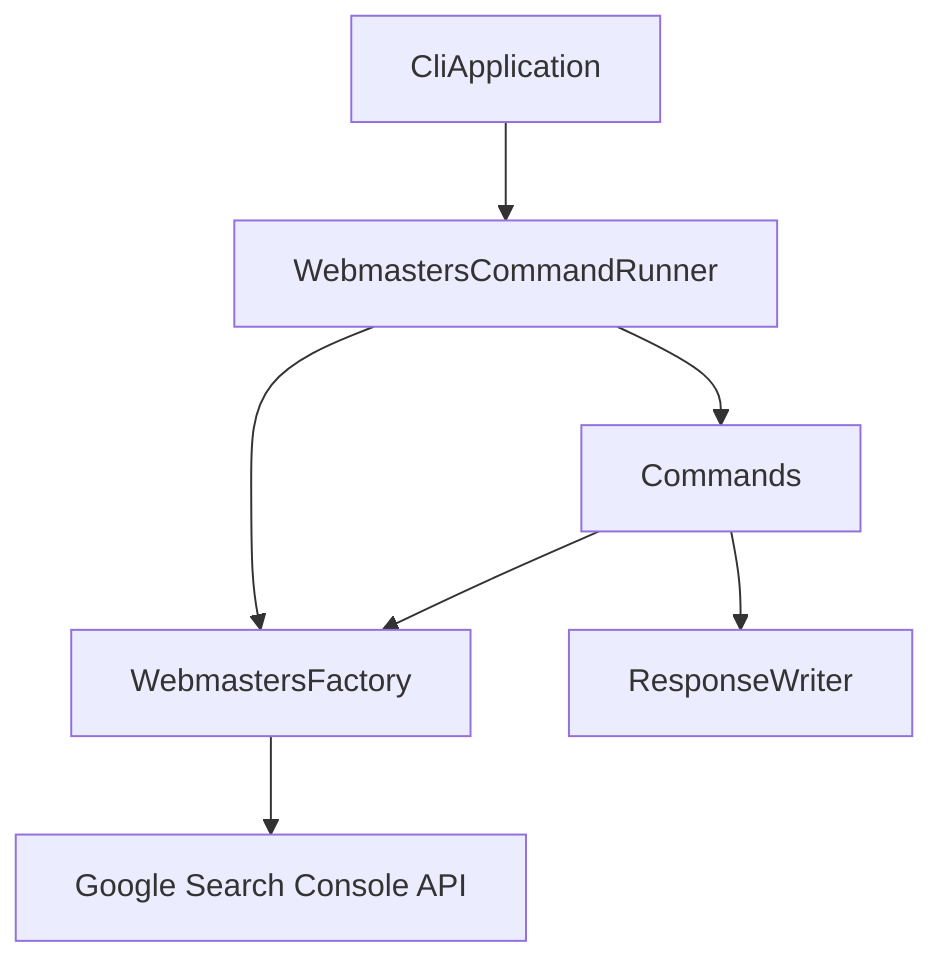

# システムパターン

## システムアーキテクチャ

## 主要コンポーネント
1. **CliApplication**
   - Spring Bootアプリケーションのエントリーポイント
   - コマンドライン引数の初期処理

2. **WebmastersCommandRunner**
   - コマンドの実行制御
   - サブコマンドのディスパッチ
   - エラーハンドリング

3. **WebmastersFactory**
   - Google API クライアントの生成
   - 認証情報の管理
   - APIセッションの制御

4. **Command Interface**
   - すべてのサブコマンドの基本インターフェース
   - 共通の実行パターンを定義
   - 使用方法の標準化

5. **ResponseWriter**
   - API レスポンスの出力制御
   - フォーマット変換
   - 出力先の管理

## 設計パターン
1. **Factory Pattern**
   - WebmastersFactory による API クライアントの生成
   - 一貫した初期化と構成

2. **Command Pattern**
   - サブコマンドの実装に使用
   - 機能の分離と再利用性の向上

3. **Dependency Injection**
   - Spring Framework による DI
   - コンポーネント間の疎結合化

4. **Strategy Pattern**
   - 出力フォーマットの切り替え
   - レスポンス処理の柔軟性

## コンポーネントの関係
- すべてのサブコマンドは Command インターフェースを実装
- WebmastersFactory は Google API クライアントを提供
- ResponseWriter は出力フォーマットを制御
- WebmastersCommandRunner がコマンドの実行を管理